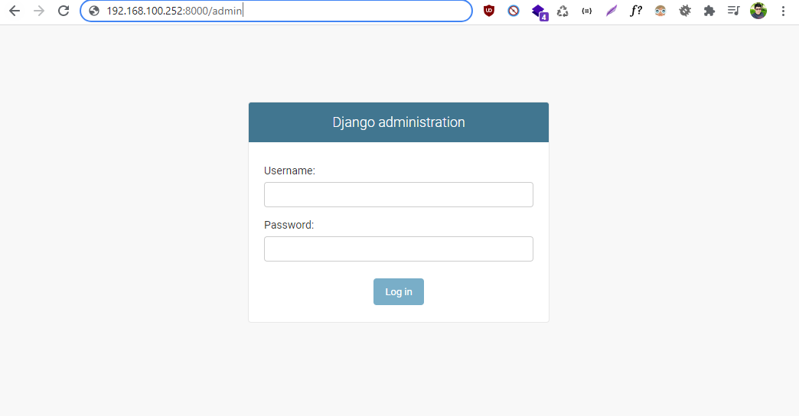
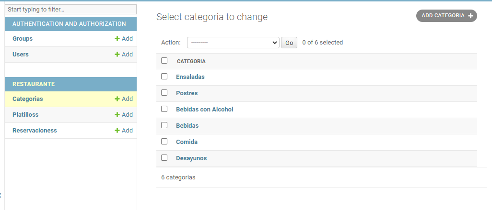
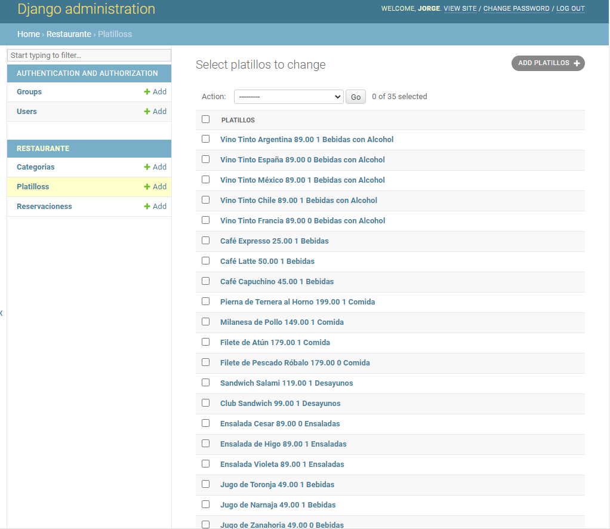
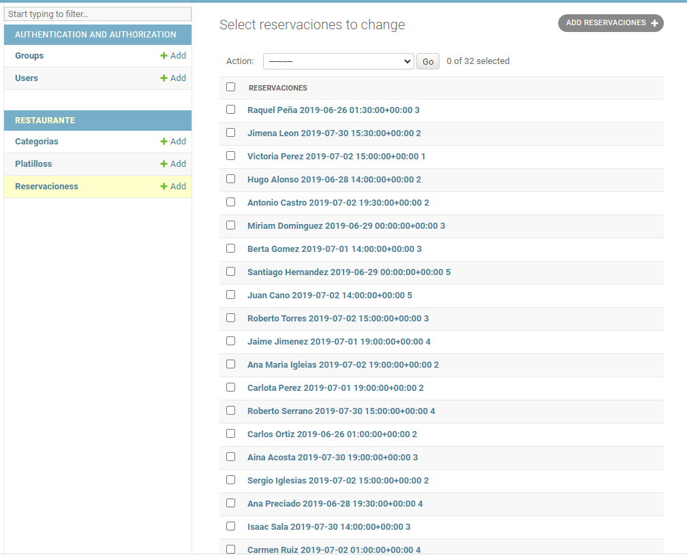
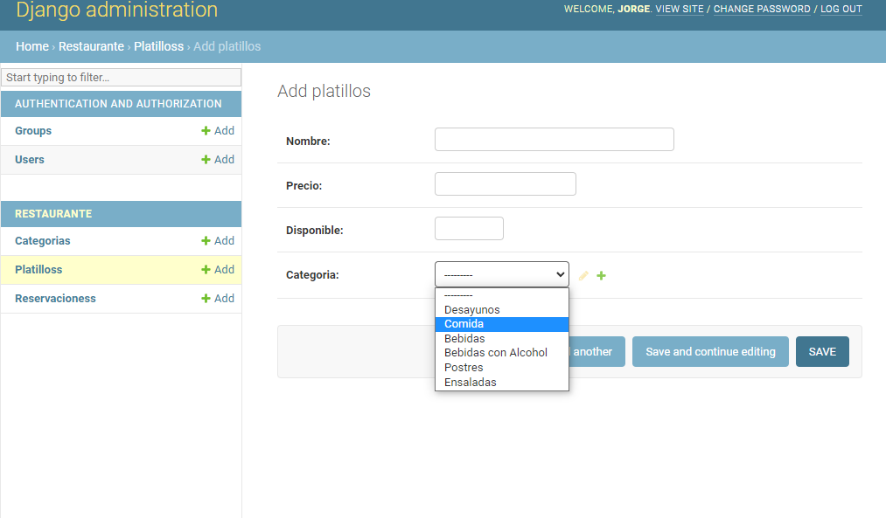

# ExamenFinal

Para probar en pycharm, debe de estar en la raiz del proyecto

### Tener virtualenv
```
pip install virtualenv
```
### Creamos nuestro entorno
```
python -m venv env
```
### Cambiamos a nuestro entorno
Windows
```
.\env\Scripts\activate
```
### Instalamos dependencias
```
pip install -r .\requerimientos\reque.txt
```
### Ejecutamos nuestra paguina web.
Nota: primero debe tener creado la base de datos. Caso contrario le va a decir que no existe la base de datos.
```
python .\manage.py runserver 0.0.0.0:8000
```

## BASE DE DATOS
Es importante tener una base de datos. En este caso de utiliza la base de datos POSTGRESQL y una base de datos llamado examen

### Creacion de la base
```
python manage.py makemigrations
```

```
python manage.py migrate
```

## Aceeso de la pagina web.
Como primera instancia, hay que crear un superusuario. Seguir los pasos que indica el asistente
```
python manage.py createsuperuser
```

### Pagina web
en el navegador poner: localhost:8000/admin. He ingresa el usuario que lo creo con createsuperuser










